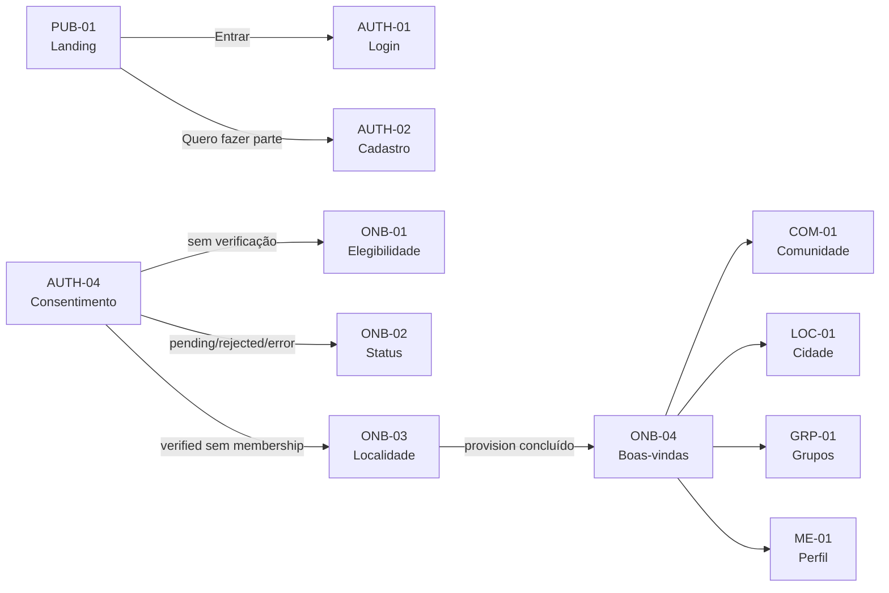
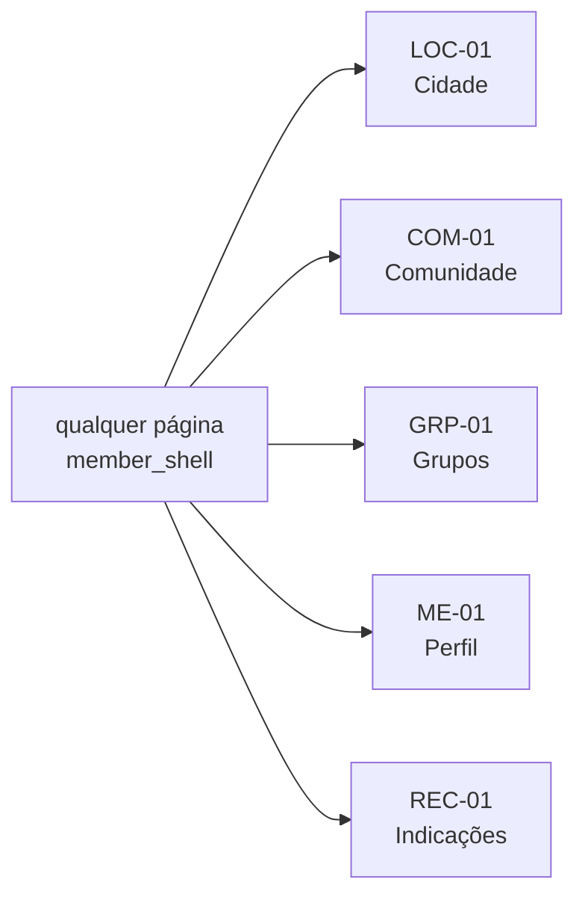
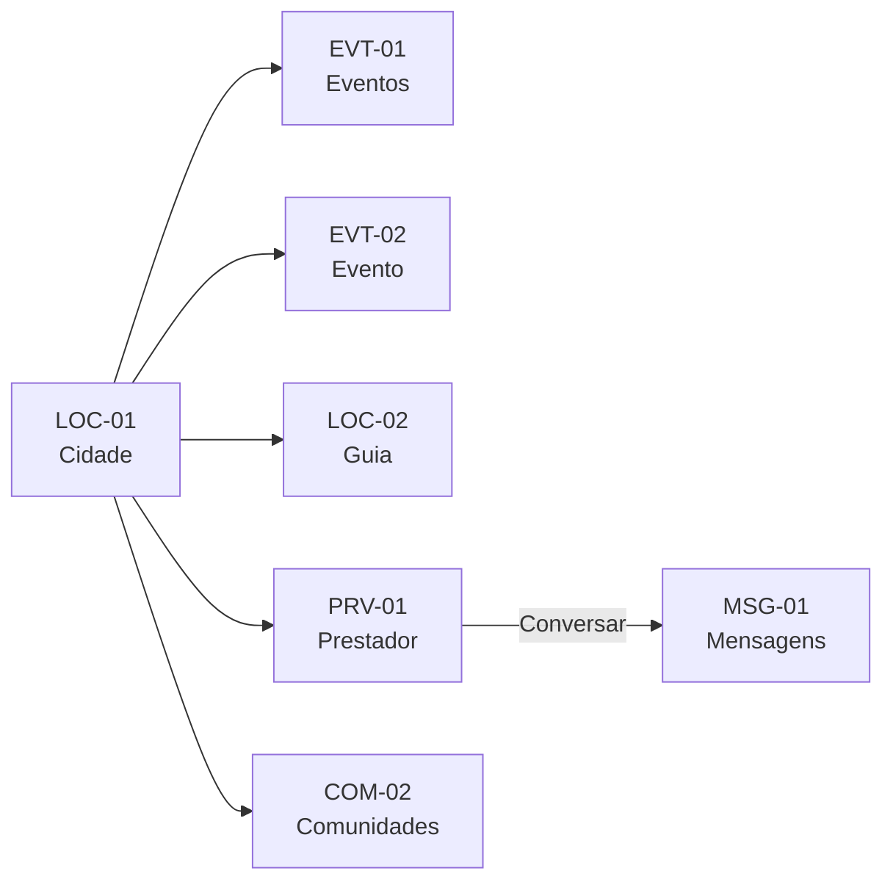
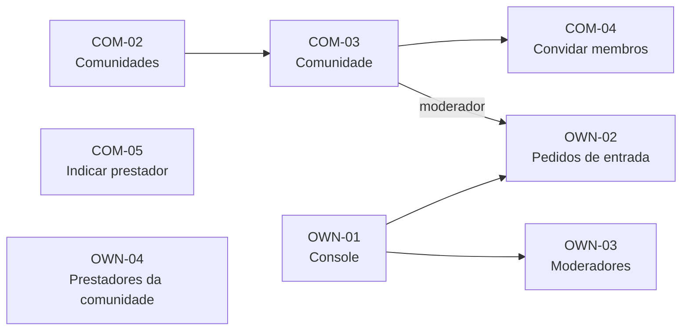
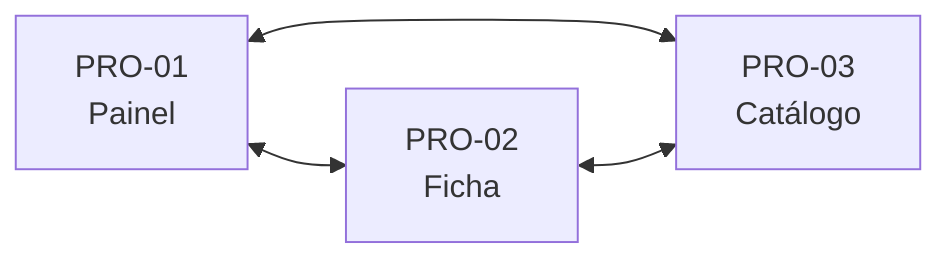
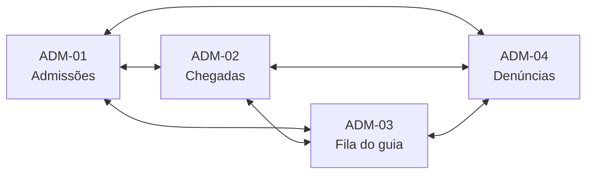

# Bivaque — Flow Map

Este arquivo usa os IDs estáveis de `PAGE_REGISTRY.yaml`. As setas abaixo representam navegação observada no código ou transições de sistema explicitamente identificadas.

## 1. Aquisição, acesso e entrada

O middleware também intercepta rotas protegidas para consentimento/login conforme estado de sessão, e roteia contas de prestador para `PRO-01`.

## 2. Shell do membro

Todas as páginas sob o shell do membro herdam estas saídas globais:

`NOT-01` não entra neste conjunto porque o controle de Notificações no shell atual é um botão sem navegação.

## 3. Cidade

## 4. Comunidades

`COM-05` e `OWN-04` aparecem isolados propositalmente: são candidatos a órfão na análise estática atual, não defeitos de runtime declarados.

## 5. Portais especializados

### Prestador

O layout do prestador expõe os três destinos em todas as páginas do portal.

### Operador

O layout do operador expõe os quatro destinos em todas as páginas administrativas.

## 6. Entradas externas/sistêmicas

Estas páginas não devem ser marcadas órfãs apenas por não terem inbound link convencional:

- `AUTH-03` — erro de callback;
- `INV-01` — convite de prestador por token;
- `INV-02` — convite de membro por token.

## Critério de “caminho sem saída”

Uma página só é considerada dead-end quando, no estado analisado, o usuário não possui saída funcional apropriada. Páginas dentro de um shell normalmente herdam saídas globais; portanto uma página pode ser **órfã de entrada** sem ser **dead-end de saída**.
